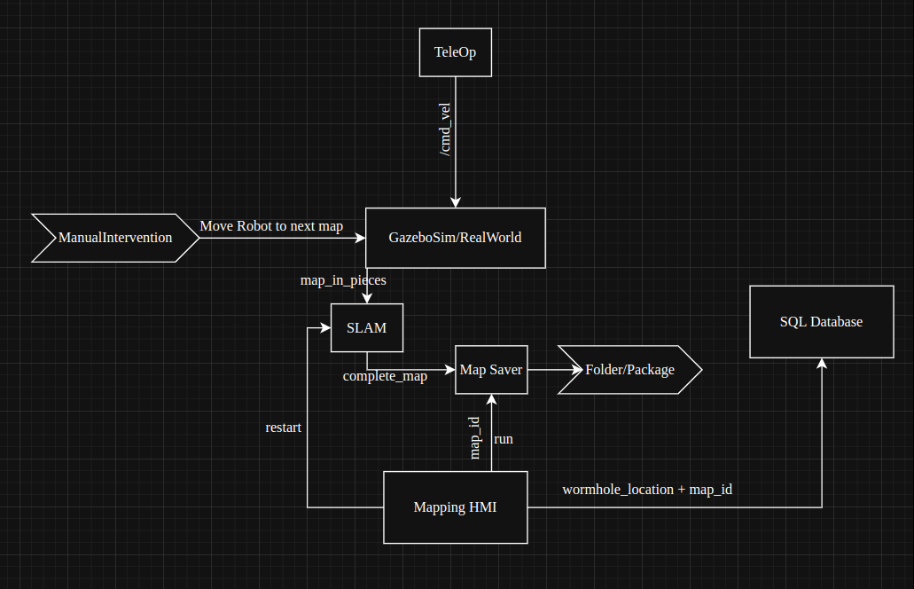
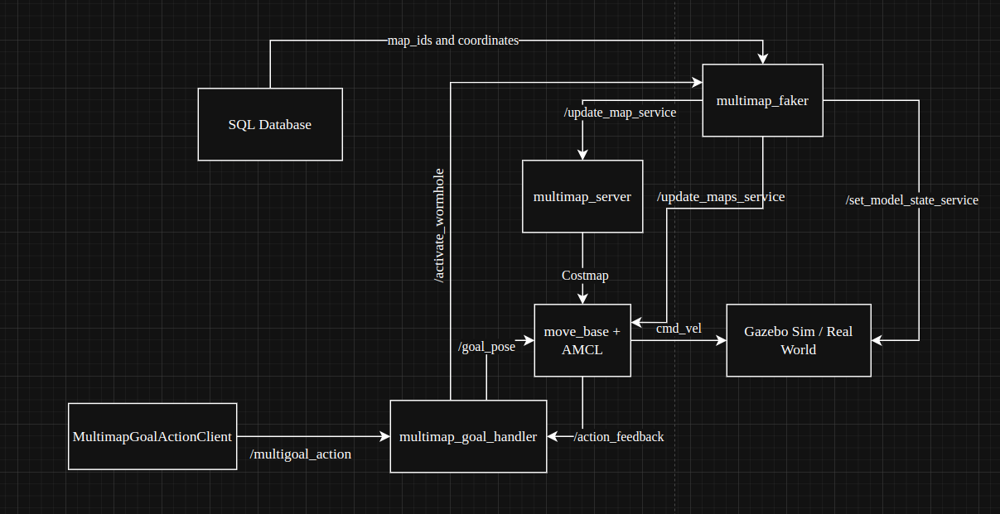
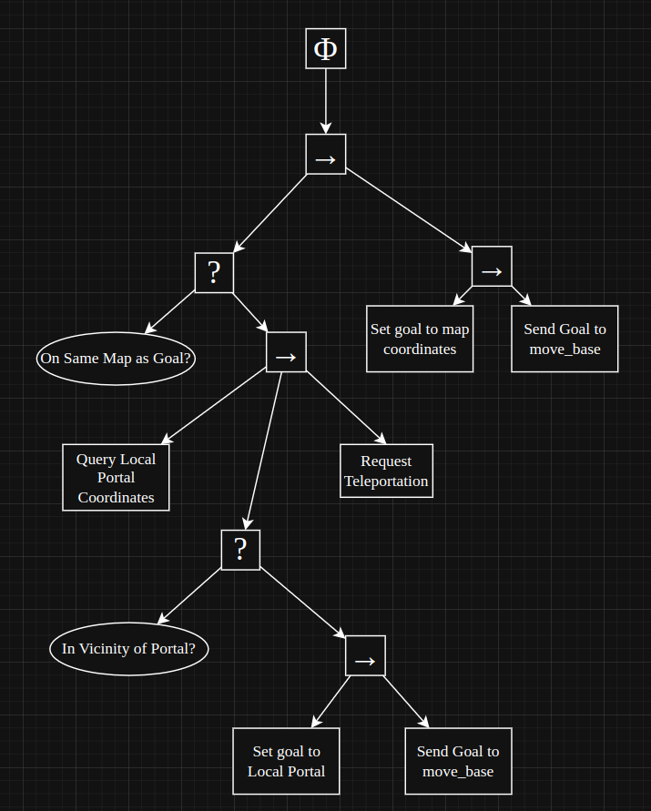

# 📂 Project Title

> Coding Assignment for [Company Name] Hiring Test

## 📋 Table of Contents

- [Overview](#-overview)
- [Assignment Instructions](#-assignment-instructions)
- [Project Structure](#-project-structure)
- [Setup & Installation](#-setup--installation)
- [Package Description](#-package-description)
- [Design Consideration](#-design-considerations)


---

## ✅ Overview

This project was developed as part of a coding assignment for the [Robotics Software Developer] position at **[ANSCER Robotics]**. The goal was to implement [an action server wrapper for move_base that can handle multiple maps connected with a wormhole].

---

## 📄 Assignment Instructions

> Link to the [assignment PDF](./ANSCER_ROSAssignment.pdf).

- Map each room and identify wormholes between them.
- Implement and SQL database to save the posittions of the wormhole.
- Implement a C++ action server to handle multi-map navigation goals. (If the robot is on same map, the goal should be passed to move_base server, else robot should go to the wormhole first.)

---

## 🏗 Project Structure

```bash
.
├── ANSCER_ROSAssignment.pdf
├── hmi_multimap             # Mapping Human-Machine-Interface and the multi-map navigation action client note
├── multimap_msgs            # Multi-map Navigation related interfaces
├── multimap_nav_server      # Package containing the C++ multi-map navigation server
├── multimap_sim             # Simulation launch files and world description
└── README.md
```

---

## ⬇Setup and Installation

### Installation
1. Make a catkin_workspace
2. Clone the repository in the src folder.
3. Install the ros turtlebot3 packages. 
`sudo apt install ros-{$ROS_DISTRO}-turtlebot3-*`
4. Build the workspace and source it.
5. Create a folder for storing maps and datbase. Export its path as MULTIMAP_STORAGE_PATH.
6. `export TURTLEBOT3_MODEL=waffle`

NOTE: Last two steps should be done for all the workspaces running this stack, along with sourcing the workspace.

### Mapping Multiple Maps and Database
- Run the following commands in individual terminals
1. `roslaunch multimap_sim turtlebot3_multimap.launch`
2. `rosrun hmi_multimap mapping.py`
3. Follow the video to create the maps and database.

### Run the Multi-Map Navigation Action Server
- Run the following commands in individual terminals
1. `roslaunch multimap_sim turtlebot3_multimap_navigation.launch`
2. `rosrun multimap_sim wormhole_faker.py`
3. `rosparam load $(rospack find multimap_nav_server)/config/params.yaml && rosrun multimap_nav_server multimap_nav_server`
4. `rosrun hmi_multimap multimap_nav_client.py`: To test the stack. Can use some other custom client node.

---

## 📂 Package Descriptions

### hmi_multimap
A package that contains various nodes and script that provide a human interface to use the stack and test the nodes.
```bash
.
├── launch
│   ├── mapping_tools.launch   # Launch file to launch mapping tools (except SLAM) : Used in mapping.py
│   └── slam_node.launch       # Launch file to launch the slam node : Used in mapping.py
└── scripts
    ├── mapping.py             # Tkinter based GUI to easily map new rooms, save the maps and also save the wormhole locations
    └── multimap_nav_client.py # Python client to test the multi-map navigation action sever
```

### multimap_msgs
Interface package to contain all the new msgs, srvs and actions specific to this project.
```bash
.
├── action
│   └── MultiMapNavigation.action # Action file for multi-map navigation action
└── srv
    └── RequestTeleportation.srv  # Srv for the wormhole activation service
```                

### multimap_nav_server
Package that contains the implementation of C++ multi-map navigation server.
```bash
.
├── config
│   ├── multimap_nav_bt.xml               # Behavior Tree Structure for the action server
│   └── params.yaml                       # Parameters required by the action server
├── include
│   └── multimap_nav_server
│       ├── move_base_action_client.hpp   # Header for the BT-node cum client handling interaction with move_base
│       ├── multimap_nav_action_server.hpp # Header for the multi-map navigation action server
│       ├── portal_service_client.hpp     # Header for the BT-node cum service client calling the teleportation server
│       ├── portal_vicinity_checker.hpp   # Header for the BT-node that subscribes to the robot_pose and checks if it is near a portal
│       └── sql_query_maker.hpp           # Header for the BT-node that makes SQL queries to wormhole db and fetch the portal location
├── launch
│   └── multimap_navigation.launch
└── src
    ├── main.cpp                          # The main executable node
    ├── move_base_action_client.cpp       # move_base_action_client.hpp
    ├── multimap_nav_action_server.cpp    # multimap_nav_action_server.hpp
    ├── portal_service_client.cpp         # portal_service_client.hpp
    ├── portal_vicinity_checker.cpp       # portal_vicinity_checker.hpp
    └── sql_query_maker.cpp               # sql_query_maker.hpp
```

### multimap_sim
Package that contains the simulation launch files and gazebo world description.
```bash
.
├── launch
│   ├── turtlebot3_multimap.launch             # Launch file to launch simulation
│   ├── turtlebot3_multimap_navigation.launch  # Launch file to launch simulation + navigation stack
│   └── turtlebot3_navigation.launch           # Launch file for navigation stack
├── scripts
│   └── wormhole_faker.py                      # Python node to teleport the robot and initialise it in new map
└── worlds
    └── multi_rooms.sdf                        # Gazebo world description
```
---

## 🧠Design Considerations
1. Component Diagram (for overall implementation)
- Started by creating the following component diagrams to visualise how the stack will work during mapping and navigation phase.
#### Multi-Map Mapping Architecture


#### Multi-Map Mapping Architecture


2. Modularity and Behavior Tree (for multi-map navigation action server implementation)
- Created a behavior tree diagram to define and visualise how multi-map navigation action server will behave.
- Leveraged the behavior tree stack as the backbone of multi-map navigation action server for maximum modularity of the modules created.
- Heavily relied on OOP, created headers and source files separately.
- Broke down every interface (SQL, MoveBase Action Client, Teleportation Service Client, etc.) separately first, and then inherited from them to make behvaior tree nodes.
- Implemented `MoveBaseHandler` as *Singleton* class to not allow more than one instances interacting with move_base (and accidently sending multiple goals).
- Used a single instance of Node Handle throughout the code to ensure memory efficiency and a single point of contact with ROS.
- Used AsyncSpinner for multithreading and also used mutex to safe-guard variables wherever required.
- AVOIDED HARDCODING: Stored all important topic, services and action names to the `config/params.yaml` and loaded them from parameter server as required.

#### Behavior Tree for Multi-Map Navigation


3. SQL Schema: Simple and Lean
- Create and implemented an SQL Schema (with help of ChatGPT) that simply stores a pose values corresponding to a map_id.
```bash
$ sqlite3 wormholes.db ".schema"
CREATE TABLE map_data (
      map_id TEXT PRIMARY KEY,
      x REAL,
      y REAL,
      qx REAL,
      qy REAL,
      qz REAL,
      qw REAL
  );
```

---

## Execution video
You can find execution videos at [this link](https://drive.google.com/drive/folders/17DSUisf4Ep9MD1k2Oo5nU6hD5N_3YhwH?usp=drive_link) 
